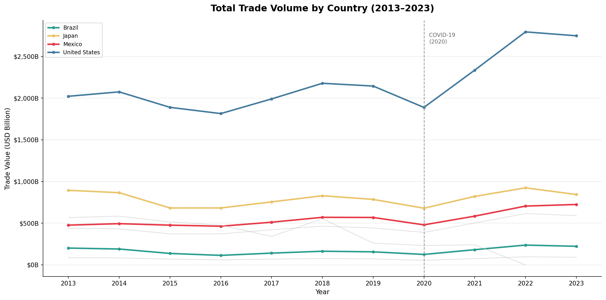
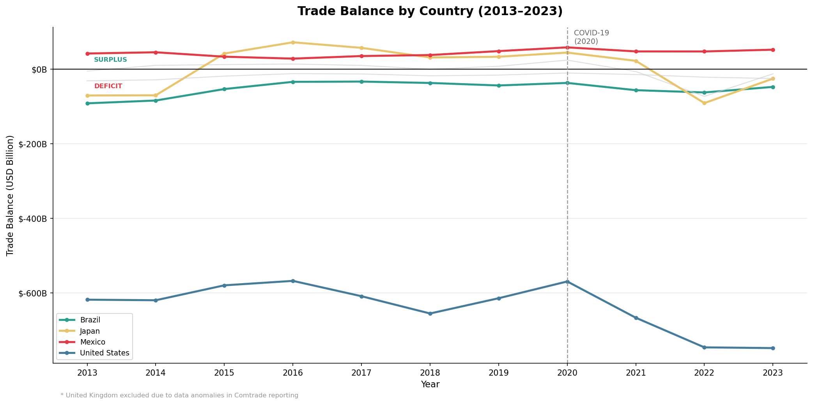
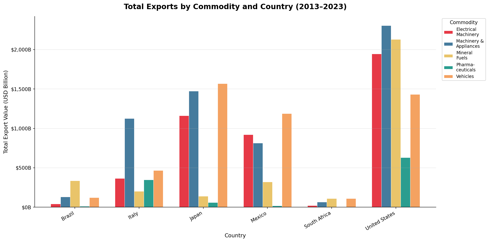

# 🌍 Global Trade Analysis (2013–2023)

> **End-to-end data pipeline** analysing trade patterns across 11 major economies — from raw API ingestion to a normalised PostgreSQL database, advanced SQL analytics, and publication-quality visualisations.


---

## Business questions

This project was designed to answer real strategic questions that matter to trade analysts, supply chain teams, and policy researchers:

- Which countries are becoming more trade-dependent over time?
- How did COVID-19 disrupt global trade flows — and how fast did they recover?
- Which economies are most exposed to commodity price shocks?
- Is Mexico's rise as a manufacturing hub reflected in trade data?
- How does trade openness correlate with GDP growth across different income groups?

---

## The killer insight

> **Trade volumes recovered faster than GDP post-COVID.**
>
> Across all 11 economies, trade returned to pre-pandemic levels by 2021 — while GDP growth remained sluggish in several. This suggests that supply chains adapted faster than domestic economies, with trade acting as an early recovery signal. For supply chain analysts and procurement teams, this is a leading indicator worth monitoring.

---

## Key findings

| Economy | Finding | Why it matters |
|---|---|---|
| 🇺🇸 United States | Trade deficit grew from **-$618B (2013) to -$800B+ (2022–23)**, driven by machinery, electrical equipment, and vehicles | Structural dependency on imports — a persistent vulnerability to tariff shocks and supply chain disruptions |
| 🇲🇽 Mexico | Total trade volume is **rapidly closing the gap with Japan** (~$705B vs ~$924B in 2022) despite a fraction of Japan's GDP | Signals Mexico's growing strategic importance in global manufacturing supply chains — relevant for any company with North American operations |
| 🌐 All economies | **COVID-19 caused a sharp contraction in 2020** — US trade dropped from $2,178B (2018) to $1,889B — followed by a recovery to $2,795B in 2022, **outpacing GDP** | Trade recovered faster than GDP, suggesting supply chains are more resilient than macroeconomic indicators alone suggest |
| 🇧🇷 🇨🇦 Brazil & Canada | Export portfolios are **heavily concentrated in mineral fuels** | High exposure to commodity price volatility — these economies show the highest year-on-year trade value swings in the dataset |
| 🇯🇵 Japan | Dominates globally in **vehicle exports** — consistent across the full decade | Despite years of "de-industrialisation" narratives, Japan's manufacturing export base remains structurally entrenched |

---

## Visualisations

### Total trade volume by country (2013–2023)


### Trade balance by country (2013–2023)

> *UK excluded due to anomalous spikes in Comtrade reporting (2017, 2019, 2020)*

### Total exports by commodity and country


---

## SQL highlights

Two sample queries from [`sql/trade_analysis_queries.sql`](sql/trade_analysis_queries.sql):

**Year-on-year trade growth using window functions:**
```sql
SELECT
    country,
    year,
    trade_value,
    ROUND(
        (trade_value - LAG(trade_value) OVER (PARTITION BY country ORDER BY year))
        / NULLIF(LAG(trade_value) OVER (PARTITION BY country ORDER BY year), 0) * 100,
        2
    ) AS yoy_growth_pct
FROM trade_flows
ORDER BY country, year;
```

**Trade openness ratio (trade as % of GDP):**
```sql
SELECT
    tf.country,
    tf.year,
    SUM(tf.trade_value) AS total_trade,
    wb.gdp_usd,
    ROUND(
        SUM(tf.trade_value) / NULLIF(wb.gdp_usd, 0) * 100,
        2
    ) AS trade_openness_pct
FROM trade_flows tf
JOIN wb_indicators wb
    ON tf.country = wb.country AND tf.year = wb.year
GROUP BY tf.country, tf.year, wb.gdp_usd
ORDER BY trade_openness_pct DESC;
```

The full SQL file also includes export ranking with `RANK() OVER (PARTITION BY country)`, surplus/deficit classification with `CASE WHEN`, and multi-table joins linking trade flows to macroeconomic indicators.

---

## Pipeline architecture

```
UN Comtrade API          World Bank API
      │                       │
      └──────────┬────────────┘
                 ▼
        Python ETL pipeline
        (comtradeapicall, wbgapi, pandas)
                 │
          Data cleaning &
          transformation
                 │
                 ▼
        PostgreSQL database
        ┌─────────────────────┐
        │  countries    (13)  │
        │  commodities   (5)  │
        │  trade_flows  (957) │
        │  wb_indicators(132) │
        └─────────────────────┘
                 │
                 ▼
     SQL analytics + Python visualisations
```

---

## Database schema

4 normalised tables with foreign key constraints, indexes, and data integrity checks:

| Table | Rows | Description |
|---|---|---|
| `countries` | 13 | Country metadata — region, income group |
| `commodities` | 5 | HS commodity codes and categories |
| `trade_flows` | 957 | Export/import values by country, commodity, year |
| `wb_indicators` | 132 | GDP, growth, inflation, population per country/year |

---

## How to run this project

**Prerequisites:** Python 3.8+, PostgreSQL 15, a free UN Comtrade API key

```bash
# 1. Clone the repo
git clone https://github.com/Hazeezat-bit/global-trade-analysis.git
cd global-trade-analysis

# 2. Install dependencies
pip install -r requirements.txt

# 3. Set up your database
# Create a PostgreSQL database named 'trade_analysis'
# Update the connection string in src/trade_analysis.py

# 4. Run the pipeline
python src/trade_analysis.py

# 5. Run SQL queries
# Open sql/trade_analysis_queries.sql in your PostgreSQL client
# or run via psql:
psql -d trade_analysis -f sql/trade_analysis_queries.sql
```

---

## Tech stack

| Tool | Role |
|---|---|
| Python 3 | ETL pipeline, data cleaning, visualisation |
| pandas | Data manipulation and transformation |
| comtradeapicall | UN Comtrade API ingestion |
| wbgapi | World Bank indicators API |
| psycopg2 / SQLAlchemy | PostgreSQL loading and querying |
| matplotlib | Chart production |
| PostgreSQL 15 | Relational database |

---

## Project structure

```
global-trade-analysis/
├── data/
│   ├── countries.csv
│   ├── commodities.csv
│   ├── wb_indicators.csv
│   └── trade_flows_cleaned.csv
├── charts/
│   ├── chart1_trade_over_time.png
│   ├── chart2_trade_balance.png
│   └── chart3_export_commodities.png
├── sql/
│   └── trade_analysis_queries.sql
├── src/
│   └── trade_analysis.py
└── README.md
```

---

## Known limitations

| Issue | Status |
|---|---|
| India returned 0 rows from the Comtrade API | Documented, excluded from analysis |
| China, Germany, France, Canada — incomplete year coverage due to Comtrade 500-row API cap | Excluded from time-series charts |
| UK trade balance shows anomalous spikes in 2017, 2019, 2020 | Excluded from Chart 2 |

---

## Data sources

- **[UN Comtrade](https://comtradeplus.un.org/)** — bilateral trade flows by HS commodity code (2-digit), annual, 2013–2023
- **[World Bank Development Indicators](https://databank.worldbank.org/source/world-development-indicators)** — GDP, GDP growth, inflation, population

---

## About the author

**Hazeezat Adebayo** — MSc Data Science (University of Padua) | Data Scientist & Analyst

[Portfolio](https://www.datascienceportfol.io/Hazeezatadebayo) · [LinkedIn](https://www.linkedin.com/in/hazeezat-adebayo-b460b922a/) · [GitHub](https://github.com/Hazeezat-bit)
